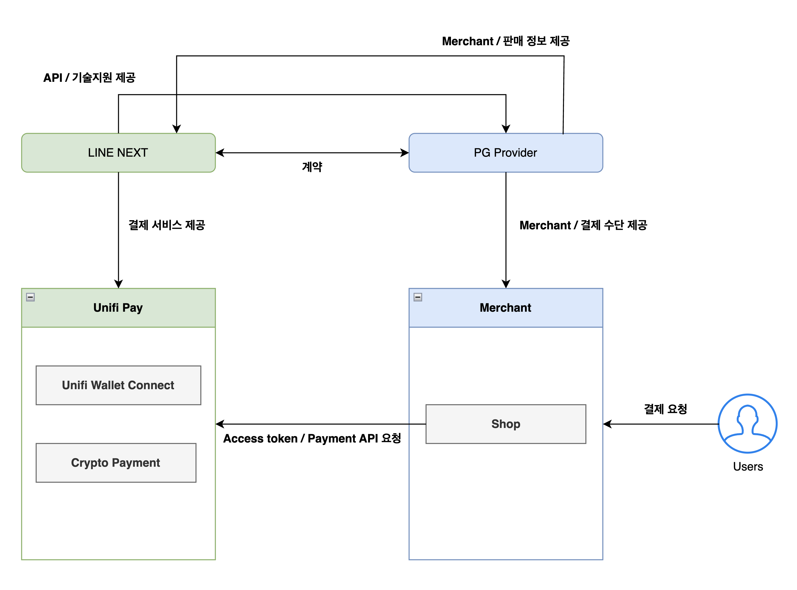

# Unifi Pay

## Overview

<figure><figcaption></figcaption></figure>

Unifi Pay는 PG사가 기존 결제 플로우 내에서 Unifi 지갑 기반의 스테이블코인 결제 수단을 추가할 수 있도록 제공되는 서비스 입니다.\
PG사는 별도의 결제 인프라 구축 없이 Unifi Pay API를 통해 결제 생성, 상태 조회, 정산까지 연동할 수 있습니다.

## Key Features

#### 스테이블코인 결제 지원

* Unifi 지갑 기반 스테이블코인 결제 지원
* Unifi 월렛을 통한 사용자 인증 및 결제 지원

#### Redirect 기반 결제 UX

* PG -> Unifi Pay -> 결제 페이지 이동
* 별도 SDK 연동 없이 웹 기반 결제 흐름 지원

#### 결제 흐름 관리

* PG ↔ Unifi ↔ 사용자 간 결제 흐름을 중앙에서 관리
* 결제 상태 및 트랜잭션 lifecycle 관리

#### API 기반 결제 처리

* 결제 생성, 시작, 상태 조회, 확정 -> 결제 과정 API로 제어 가능

#### Webhook 기반 상태 동기화

* 결제 완료 / 실패 / 환불 상태 실시간 전달
* 서버 간 안정적인 상태 동기화 지원

#### 보안 인증 (HMAC 기반)

* 모든 서버 API는 HMAC 서명 필수
* timestamp 기반 replay attack 방지

#### ACL 기반 접근 제어

* API endpoint 및 method 단위 접근 제어
* 비정상 호출 차단

#### Settlement 지원

* 결제 완료 기준 정산 데이터 생성
* 수수료 및 순 정산 금액 제공

## Payment Lifecycle

1. 결제 생성 (PG -> Unifi Pay)
2. 사용자 리다이렉트
3. 사용자 인증 및 결제 진행
4. 결제 완료
5. Webhook 수신
6. 정산

## Guide List

Unifi Pay 연동 가이드는 아래 페이지를 참고해주세요.

[개발자 Guide 바로가기 >](https://docs.unifi.me/unifi-pay/get-started)
