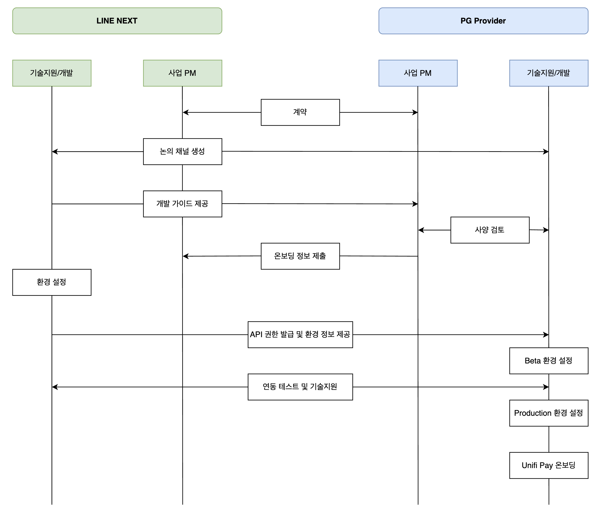

---
metaLinks:
  alternates:
    - >-
      https://app.gitbook.com/s/juuhQ1BuKwYKE7NR6geM/unifi-pay/onboarding-process
---

# Onboarding Process

<figure><figcaption></figcaption></figure>

## Business Onboarding

Unifi Pay 연동을 위해 LINE NEXT와 PG사 간 사전 협의 및 계약이 진행됩니다.

1. LINE NEXT와 PG사가 계약을 진행합니다.
2. 빠른 연동을 위해 LINE NEXT와 PG사 간의 커뮤니케이션 Hotline 채널이 생성됩니다.
3. LINE NEXT 연동을 위한 기술 스펙을 공유하고, PG사는 이에 대한 검토를 진행합니다.
4. PG사는 Unifi Pay 온보딩을 위해 필요한 정보를 제출합니다.
5. LINE NEXT는 전달받은 정보를 기준으로 환경 설정 및 권한 발급 후 PG사에게 정보를 제공합니다.
6. PG사는 연동에 필요한 API 권한을 제공받아 개발을 진행합니다.

### 제출 정보

* 서비스 정보 (도메인, 서비스명)
* 서버 IP 정보
* Webhook URL

## Technical Onboarding

LINE NEXT는 전달 받은 정보를 기반으로 환경 설정 및 인증 정보를 제공합니다.



### App 등록 및 인증 정보 발급 (LINE NEXT)

NEXT Market 등록 후 PG사 전달

* AppId 발급
* Secret Key 발급



### HMAC 인증 구현 (PG)

모든 서버 간 API 요청은 HMAC 인증이 필요합니다.

#### HMAC 생성 방식

```
BASE64( HMACSHA256(appSecret, {HTTP_METHOD}{URI}{X-AppId}{X-Timestamp}{REQUEST_BODY}) )
```

* 아래 서명값 대상을 문자열로 합쳐 PG사 측에 사전 발급된 appSecret으로 SHA256으로 서명값 생성
* 서명값 대상
  * HTTP\_METHOD: 요청시 지정한 대문자 HTTP Method (ex: GET, POST, PUT 등)
  * URI: 요청한 URI (ex: /api/v1/payment)
  * HEADER: 요청 header 중 아래 값 포함
    * X-AppId: PG사 측에 사전 발급된 appId (ex: X-AppId:payletter)&#x20;
    * X-Timestamp: 요청시 밀리초단위 timestamp 값 (ex: X-Timestamp:1773017787000)
      * 현재 시각과 5분 이상 차이가 나면 요청 거부
  * REQUESET\_BODY: 요청시 request body



### IP / ACL 등록 (LINE NEXT & PG)

보안 강화를 위해 접근 제어가 적용됩니다.

* API 호출 IP Whitelist 등록
* Endpoint 및 Method 기반 ACL 설정



### 연동 및 검증 (LINE NEXT & PG)

연동 완료 후 정상동작 여부를 검증합니다.

* 결제 생성 API 정상 동작
* redirect 정상 동작
* 결제 완료 처리 정상 동작
* Webhook 정상 수진
* 상태 조회 API 정상 동작



## Guide List

Unifi Pay 연동 가이드는 아래 페이지를 참고해주세요.

[개발자 Guide 바로가기 >](https://docs.unifi.me/unifi-pay/get-started)
